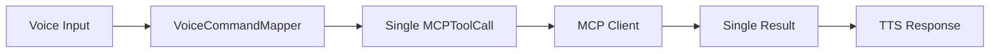
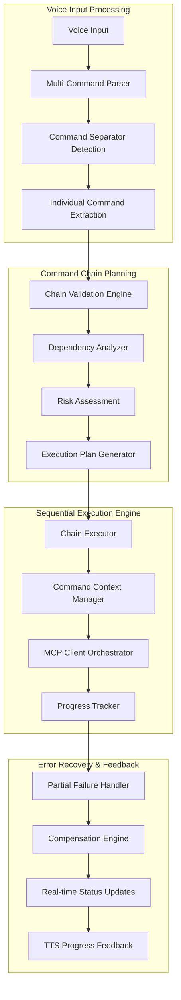

# Multi-Command Chaining Architecture Plan

## Voice MCP Gateway Enhancement

**Document Version**: 1.0
**Created**: 2025-09-28
**Status**: Design Phase - Ready for Implementation

---

## 🎯 Executive Summary

This document outlines the comprehensive architectural design for implementing multi-command chaining in the Voice MCP Gateway. The enhancement will enable users to issue complex voice commands like "list files and create folder test and then run npm install" which will be parsed, validated, and executed as a sequence of coordinated MCP operations.

**Key Goals**:

- Enable natural speech patterns for complex workflows
- Maintain <1000ms end-to-end latency per command in chain
- Provide robust error handling and partial failure recovery
- Ensure security validation for each command in the chain
- Preserve backward compatibility with existing single-command architecture

---

## 📊 Current Architecture Analysis

### Existing Components Overview

| Component | Current Responsibility | Multi-Command Impact |
|-----------|----------------------|---------------------|
| **VoiceCommandMapper** | Maps single voice command to single MCP tool call | **MAJOR**: Needs to return array of commands |
| **MCP Client** | Executes single tool call with circuit breaker | **MINOR**: Already supports sequential calls |
| **Session State Manager** | Manages session state and active commands | **MODERATE**: Needs chain command tracking |
| **Confirmation Workflows** | Handles single command confirmations | **MODERATE**: Needs chain-level confirmations |
| **Voice Server** | Orchestrates single command flow | **MAJOR**: Needs sequential execution logic |
| **WebSocket Server** | Real-time voice communication | **MINOR**: Progress updates for chains |

### Current Data Flow



### Current Limitations for Multi-Command

1. **Single Command Focus**: `VoiceCommandMapper.mapCommand()` returns `MappingResult` with single `MCPToolCall`
2. **No Dependency Management**: No way to pass outputs from one command as inputs to the next
3. **No Partial Recovery**: If command 3 of 5 fails, entire operation fails
4. **No Progress Feedback**: User gets no intermediate status during long chains
5. **Confirmation Complexity**: High-risk commands in chains need sophisticated confirmation flows

---

## 🏗️ Proposed Multi-Command Architecture

### Overview Architecture



### Core Components Enhancement

#### 1. Enhanced VoiceCommandMapper

**Current**: Returns single `MappingResult`
**New**: Returns `MappingResult | MultiCommandResult`

```typescript
interface MultiCommandResult {
  mcpCalls: MCPToolCall[];              // Array of commands to execute
  overallConfidence: number;            // Minimum confidence across all commands
  highestRiskLevel: RiskLevel;          // Highest risk level in the chain
  requiresConfirmation: boolean;        // True if any command needs confirmation
  commandCount: number;                 // Number of commands in chain
  separatorPattern: string;             // Which separator was detected
  individualResults: MappingResult[];   // Results for each individual command
  dependencies: CommandDependency[];    // Inter-command dependencies
  executionStrategy: ExecutionStrategy; // Sequential/parallel/conditional
}

interface CommandDependency {
  sourceIndex: number;                  // Index of command providing data
  targetIndex: number;                  // Index of command consuming data
  parameterMapping: {                   // How to map output to input
    outputField: string;
    inputParameter: string;
    transformation?: TransformFunction;
  };
  required: boolean;                    // If dependency failure should stop chain
}

type ExecutionStrategy = "sequential" | "parallel" | "conditional";
```

#### 2. Multi-Command Separator Detection

**Natural Language Patterns**:

```typescript
const COMMAND_SEPARATORS = [
  { pattern: /\s+and\s+then\s+/i, name: 'and then', strategy: 'sequential' },
  { pattern: /\s+then\s+/i, name: 'then', strategy: 'sequential' },
  { pattern: /\s+and\s+also\s+/i, name: 'and also', strategy: 'parallel' },
  { pattern: /\s+and\s+/i, name: 'and', strategy: 'sequential' },
  { pattern: /\s+also\s+/i, name: 'also', strategy: 'parallel' },
  { pattern: /[.,]\s*then\s+/i, name: 'punctuation then', strategy: 'sequential' },
  { pattern: /\s+if\s+successful\s+/i, name: 'conditional', strategy: 'conditional' },
  { pattern: /\s+after\s+that\s+/i, name: 'after that', strategy: 'sequential' }
];
```

#### 3. Chain Execution Engine

**New Component**: `ChainExecutor` class

```typescript
export class ChainExecutor extends EventEmitter {
  async executeChain(
    multiCommand: MultiCommandResult,
    sessionId: string,
    mcpClient: MCPClient
  ): Promise<ChainExecutionResult> {

    const executionContext = this.createExecutionContext(multiCommand, sessionId);
    const results: CommandResult[] = [];

    try {
      switch (multiCommand.executionStrategy) {
        case 'sequential':
          return await this.executeSequential(multiCommand, executionContext, mcpClient);
        case 'parallel':
          return await this.executeParallel(multiCommand, executionContext, mcpClient);
        case 'conditional':
          return await this.executeConditional(multiCommand, executionContext, mcpClient);
      }
    } catch (error) {
      return await this.handleChainFailure(error, results, executionContext);
    }
  }
}
```

#### 4. Command Context Management

**Purpose**: Manage state and data flow between commands in a chain

```typescript
interface ExecutionContext {
  sessionId: string;
  chainId: string;
  startTime: Date;
  commandOutputs: Map<number, MCPToolResult>;  // Results from completed commands
  sharedVariables: Map<string, unknown>;       // Shared data between commands
  workingDirectory: string;                    // Current working directory
  environmentContext: Record<string, unknown>; // Environmental state
  userConfirmations: Set<string>;              // Already confirmed operations
  securityContext: SecurityContext;           // Security state for chain
}

class CommandContextManager {
  resolveParameters(
    command: MCPToolCall,
    commandIndex: number,
    context: ExecutionContext,
    dependencies: CommandDependency[]
  ): MCPToolCall {
    // Resolve parameter dependencies from previous command outputs
    // Handle template substitution: "create folder {output.0.directoryName}"
    // Apply parameter transformations and validations
  }
}
```

#### 5. Dependency Resolution System

**Smart Parameter Passing**:

```typescript
// Example: "list files in src and create backup of package.json in that folder"
const dependencies = [
  {
    sourceIndex: 0,  // list files command
    targetIndex: 1,  // create backup command
    parameterMapping: {
      outputField: "directory.path",
      inputParameter: "destination_path",
      transformation: (srcPath: string) => `${srcPath}/backup`
    },
    required: true
  }
];
```

**Context Variable Support**:

```typescript
// Voice: "go to Documents folder then list files then create config.json there"
// Becomes:
// 1. change_directory { path: "Documents" }
// 2. list_directory { path: "{context.workingDirectory}" }
// 3. write_file { path: "{context.workingDirectory}/config.json", content: "" }
```

#### 6. Progress Feedback System

**Real-time Updates**:

```typescript
interface ChainProgressUpdate {
  chainId: string;
  commandIndex: number;
  totalCommands: number;
  currentCommand: string;
  status: 'starting' | 'executing' | 'completed' | 'failed';
  estimatedTimeRemaining: number;
  intermediateResult?: MCPToolResult;
}

// Voice feedback during execution:
// "Starting command 1 of 3: listing files..."
// "Command 1 completed. Starting command 2: creating folder..."
// "Command 2 completed. Starting command 3: running npm install..."
// "All commands completed successfully."
```

---

## 🔧 Detailed Implementation Plan

### Phase 1: Core Infrastructure (Week 1)

#### 1.1 Enhanced VoiceCommandMapper

**File**: `src/voice/voice-command-mapper.ts`

**Changes**:

```typescript
// Update return type
async mapCommand(voiceText: string, sessionId: string = 'default'): Promise<MappingResult | MultiCommandResult>

// Add new methods
private async tryMapMultiCommand(voiceText: string, sessionId: string): Promise<MultiCommandResult | null>
private detectCommandSeparators(text: string): SeparatorMatch[]
private extractIndividualCommands(text: string, separators: SeparatorMatch[]): string[]
private analyzeCommandDependencies(commands: MCPToolCall[]): CommandDependency[]
```

#### 1.2 Chain Execution Engine

**New File**: `src/voice/chain-executor.ts`

**Core Functionality**:

```typescript
export class ChainExecutor extends EventEmitter {
  // Main execution methods
  async executeChain(multiCommand: MultiCommandResult, sessionId: string): Promise<ChainExecutionResult>
  private async executeSequential(commands: MCPToolCall[], context: ExecutionContext): Promise<ChainExecutionResult>
  private async executeParallel(commands: MCPToolCall[], context: ExecutionContext): Promise<ChainExecutionResult>
  private async executeConditional(commands: MCPToolCall[], context: ExecutionContext): Promise<ChainExecutionResult>

  // Context and dependency management
  private createExecutionContext(multiCommand: MultiCommandResult, sessionId: string): ExecutionContext
  private resolveCommandDependencies(command: MCPToolCall, context: ExecutionContext): MCPToolCall
  private updateExecutionContext(result: MCPToolResult, commandIndex: number, context: ExecutionContext): void

  // Error handling and recovery
  private handleCommandFailure(error: Error, commandIndex: number, context: ExecutionContext): Promise<void>
  private attemptCommandRecovery(failedCommand: MCPToolCall, error: Error): Promise<MCPToolCall | null>
  private generateCompensationCommands(completedCommands: MCPToolCall[], context: ExecutionContext): MCPToolCall[]
}
```

#### 1.3 Context Management

**New File**: `src/voice/command-context-manager.ts`

**Responsibilities**:

- Maintain execution state between commands
- Resolve parameter dependencies
- Handle variable substitution
- Manage working directory and environment state
- Cache intermediate results for performance

### Phase 2: Advanced Features (Week 2)

#### 2.1 Dependency Analysis Engine

**Smart Dependency Detection**:

```typescript
class DependencyAnalyzer {
  analyzeCommands(commands: MCPToolCall[]): CommandDependency[] {
    // Detect file path dependencies
    // Identify output-to-input parameter flows
    // Find environmental dependencies (working directory, etc.)
    // Analyze temporal dependencies (must complete before next)
  }

  // Example: "list files in src and create backup of each .js file"
  // Detects that backup command needs file list from first command
}
```

#### 2.2 Parallel Execution Support

**Parallel Command Execution**:

```typescript
// Voice: "list processes and list files and check disk space"
// Executes simultaneously, combines results

async executeParallel(commands: MCPToolCall[], context: ExecutionContext): Promise<ChainExecutionResult> {
  const promises = commands.map((command, index) =>
    this.executeSingleCommand(command, index, context)
  );

  const results = await Promise.allSettled(promises);
  return this.combineParallelResults(results, context);
}
```

#### 2.3 Conditional Execution Logic

**Conditional Command Chains**:

```typescript
// Voice: "check if package.json exists and if it does run npm install"

interface ConditionalCommand extends MCPToolCall {
  condition: {
    type: 'file_exists' | 'command_success' | 'output_contains';
    parameter: string;
    expectedValue?: unknown;
  };
  onTrue?: MCPToolCall[];
  onFalse?: MCPToolCall[];
}
```

### Phase 3: Error Handling & Recovery (Week 3)

#### 3.1 Partial Failure Recovery

**Recovery Strategies**:

```typescript
interface RecoveryStrategy {
  type: 'retry' | 'skip' | 'compensate' | 'abort';
  maxRetries?: number;
  compensationCommands?: MCPToolCall[];
  continueOnFailure: boolean;
}

// Example: "create folders docs tests src and run npm init"
// If "tests" folder creation fails:
// - Strategy: 'skip' - continue with remaining folders and npm init
// - Strategy: 'compensate' - create alternative folder structure
// - Strategy: 'abort' - stop entire chain and revert changes
```

#### 3.2 Compensation Engine

**Automatic Rollback**:

```typescript
class CompensationEngine {
  generateRollbackCommands(completedCommands: MCPToolCall[]): MCPToolCall[] {
    // create_directory -> delete_directory
    // write_file -> delete_file
    // move_file -> move_file (reverse)
    // start_process -> kill_process
  }

  async executeCompensation(rollbackCommands: MCPToolCall[]): Promise<void> {
    // Execute compensation commands in reverse order
    // Best effort - log failures but continue
  }
}
```

#### 3.3 Chain-Level Confirmations

**Security for Command Chains**:

```typescript
// Voice: "delete all .log files and then restart the server"
// Confirmation: "This will delete multiple files AND restart the server. Say 'confirm dangerous operation' to proceed."

interface ChainConfirmationRequest {
  chainId: string;
  highRiskCommands: MCPToolCall[];
  totalCommands: number;
  estimatedImpact: string;
  requiresElevatedConfirmation: boolean;
}
```

### Phase 4: Integration & Optimization (Week 4)

#### 4.1 Voice Server Integration

**File**: `src/gateway/voice-server.ts`

**Updates to `processVoiceCommandIntegrated`**:

```typescript
private async processVoiceCommandIntegrated(
  audioBuffer: Buffer,
  sessionId: string
): Promise<VoiceCommandResult> {

  const voiceResult = await this.voiceProcessor.processVoiceCommand(audioBuffer, sessionId);

  if (voiceResult.success) {
    const mappingResult = await this.voiceCommandMapper.mapCommand(voiceResult.transcript, sessionId);

    if (this.isMultiCommandResult(mappingResult)) {
      // NEW: Handle multi-command chains
      return await this.executeCommandChain(mappingResult, sessionId);
    } else {
      // Existing: Handle single commands
      return await this.executeSingleCommand(mappingResult, sessionId);
    }
  }

  return voiceResult;
}

private async executeCommandChain(
  multiCommand: MultiCommandResult,
  sessionId: string
): Promise<VoiceCommandResult> {

  const chainExecutor = new ChainExecutor(this.mcpClient, this.logger);

  // Setup progress feedback
  chainExecutor.on('commandStarted', (update) => {
    this.sendProgressUpdate(sessionId, update);
  });

  chainExecutor.on('commandCompleted', (update) => {
    this.sendProgressUpdate(sessionId, update);
  });

  // Execute the chain
  const chainResult = await chainExecutor.executeChain(multiCommand, sessionId);

  // Convert to VoiceCommandResult format
  return this.convertChainResult(chainResult);
}
```

#### 4.2 Session State Management Enhancement

**File**: `src/voice/session-state-management.ts`

**New Interfaces**:

```typescript
interface ActiveCommandChain extends ActiveCommand {
  type: 'chain';
  chainId: string;
  totalCommands: number;
  completedCommands: number;
  currentCommandIndex: number;
  chainStrategy: ExecutionStrategy;
  partialResults: MCPToolResult[];
  dependencyGraph: CommandDependency[];
}

// Update SessionState to include chain tracking
interface SessionState {
  // ... existing fields
  activeCommandChains: ActiveCommandChain[];
  chainExecutionHistory: ChainExecutionResult[];
}
```

#### 4.3 WebSocket Enhancement for Progress Updates

**File**: `src/gateway/websocket-server.ts`

**New Events**:

```typescript
// Client-side events
socket.emit('chain_progress', {
  chainId: string,
  commandIndex: number,
  totalCommands: number,
  currentCommand: string,
  status: string,
  estimatedTimeRemaining: number
});

socket.emit('chain_completed', {
  chainId: string,
  totalCommands: number,
  successfulCommands: number,
  failedCommands: number,
  totalDuration: number,
  finalResult: ChainExecutionResult
});

socket.emit('chain_failed', {
  chainId: string,
  failedAtCommand: number,
  errorMessage: string,
  partialResults: MCPToolResult[],
  compensationAvailable: boolean
});
```

---

## 🎪 User Experience Examples

### Example 1: Simple Sequential Chain

**Voice Input**: "list files in src and then create a backup folder"

**Processing**:

1. **Separator Detection**: "and then" → Sequential execution
2. **Command Extraction**:
   - Command 1: "list files in src"
   - Command 2: "create a backup folder"
3. **MCP Mapping**:
   - Tool 1: `list_directory { path: "src" }`
   - Tool 2: `create_directory { path: "backup" }`
4. **Execution**: Sequential, no dependencies
5. **Result**: Both commands executed, success confirmation

**Voice Response**: "Listed 15 files in src folder. Created backup folder. Both operations completed successfully."

### Example 2: Dependent Command Chain

**Voice Input**: "read package.json and create a backup of that file in Documents"

**Processing**:

1. **Separator Detection**: "and" → Sequential execution
2. **Dependency Analysis**: Command 2 needs filename from Command 1
3. **Command Extraction**:
   - Command 1: "read package.json"
   - Command 2: "create a backup of that file in Documents"
4. **MCP Mapping**:
   - Tool 1: `read_file { path: "package.json" }`
   - Tool 2: `write_file { path: "Documents/package.json.backup", content: "{output.0.content}" }`
5. **Execution**: Sequential with dependency resolution
6. **Result**: File read and backup created with content

**Voice Response**: "Read package.json file. Created backup copy in Documents folder. Both operations completed."

### Example 3: High-Risk Chain with Confirmation

**Voice Input**: "delete all .log files and restart the development server"

**Processing**:

1. **Risk Assessment**: Both commands are high-risk
2. **Confirmation Required**: "This will delete multiple log files AND restart the server. Say 'confirm dangerous operation' to proceed."
3. **User Confirmation**: "confirm dangerous operation"
4. **Execution**: Sequential execution with enhanced audit logging
5. **Result**: Files deleted, server restarted

**Voice Response**: "Deleted 8 log files. Restarted development server. All operations completed with full audit trail."

### Example 4: Parallel Execution

**Voice Input**: "check disk space and also list running processes and also show network status"

**Processing**:

1. **Separator Detection**: "and also" → Parallel execution
2. **Command Extraction**: 3 independent commands
3. **MCP Mapping**: All mapped to different MCP tools
4. **Execution**: Parallel execution, results combined
5. **Result**: All three system checks completed simultaneously

**Voice Response**: "System check completed. Disk space: 45GB free. Found 23 running processes. Network status: Connected. All checks finished in 1.2 seconds."

### Example 5: Conditional Execution

**Voice Input**: "check if node_modules exists and if it does run npm update"

**Processing**:

1. **Conditional Detection**: "if...and if it does" → Conditional execution
2. **Command Mapping**:
   - Condition: `list_directory { path: ".", filter: "node_modules" }`
   - Action: `execute_command { command: "npm update" }` (if condition true)
3. **Execution**: Condition evaluated first, action conditional on result
4. **Result**: Either update executed or skipped based on condition

**Voice Response**: "Found node_modules directory. Running npm update... Update completed with 3 packages updated."

---

## 🔒 Security Considerations

### Risk Assessment for Command Chains

```typescript
interface ChainRiskAssessment {
  individualRiskLevels: RiskLevel[];
  combinedRiskLevel: RiskLevel;
  riskFactors: string[];
  requiresElevatedConfirmation: boolean;
  auditingRequired: boolean;
  estimatedSystemImpact: 'low' | 'medium' | 'high' | 'critical';
}

// Risk multiplication rules:
// Single high-risk command in chain → Entire chain becomes high-risk
// Multiple medium-risk commands → Chain becomes high-risk
// Any destructive + any system command → Requires elevated confirmation
```

### Confirmation Workflows for Chains

**Chain-Level Confirmations**:

- **Single Confirmation**: For chains with one high-risk command
- **Step-by-Step Confirmation**: For chains with multiple high-risk commands
- **Elevated Confirmation**: For chains with system-wide impact

**Example Confirmation Patterns**:

```typescript
// Pattern 1: Single confirmation for entire chain
"This will create 3 folders and install packages. Say 'confirm' to proceed."

// Pattern 2: Confirmation for high-risk steps only
"Commands 1-2 will create folders (low risk). Command 3 will delete files (high risk). Say 'confirm deletion' for step 3."

// Pattern 3: Elevated confirmation for dangerous chains
"This chain includes file deletion AND system restart. Say 'I understand the risks and confirm dangerous operation' to proceed."
```

### Audit Trail Enhancement

**Chain Execution Logging**:

```typescript
interface ChainAuditLog {
  chainId: string;
  sessionId: string;
  userId: string;
  originalVoiceCommand: string;
  detectedCommands: MCPToolCall[];
  executionPlan: ExecutionStrategy;
  confirmationsRequired: boolean;
  userConfirmations: ConfirmationResult[];
  individualCommandResults: CommandAuditLog[];
  overallResult: 'success' | 'partial_failure' | 'complete_failure';
  compensationActions: MCPToolCall[];
  securityFlags: string[];
  systemImpactAssessment: string;
}
```

---

## ⚡ Performance Optimization

### Latency Targets for Chain Execution

| Chain Type | Target Latency | Max Acceptable |
|------------|---------------|----------------|
| **2-3 Commands** | <2000ms | <3000ms |
| **4-5 Commands** | <3500ms | <5000ms |
| **Parallel Execution** | <1500ms | <2500ms |
| **With Confirmations** | +2000ms | +3000ms |

### Optimization Strategies

#### 1. Parallel Execution Where Possible

```typescript
// Detect independent commands and execute in parallel
// "list files and check disk space and show processes" → All parallel
```

#### 2. Predictive Pre-processing

```typescript
// Start processing likely next commands while confirming current ones
// Pre-validate permissions and parameters during confirmation phase
```

#### 3. Smart Caching

```typescript
// Cache command results for fast retry/compensation
// Cache directory listings for dependent commands
// Cache system state for conditional execution
```

#### 4. Progressive Feedback

```typescript
// Don't wait for entire chain to complete before first feedback
// Stream intermediate results as they become available
// Provide time estimates based on command complexity
```

---

## 🧪 Testing Strategy

### Multi-Command Test Scenarios

#### 1. Basic Sequential Chains

```typescript
const testScenarios = [
  {
    name: "Simple Sequential",
    voice: "list files and create folder test",
    expectedCommands: ["list_directory", "create_directory"],
    expectedLatency: "<2000ms"
  },
  {
    name: "Three Command Chain",
    voice: "go to Documents then list files then create config.json",
    expectedCommands: ["change_directory", "list_directory", "write_file"],
    expectedLatency: "<3000ms"
  }
];
```

#### 2. Dependency Resolution Tests

```typescript
const dependencyTests = [
  {
    name: "File Content Dependency",
    voice: "read package.json and create backup with that content",
    expectedDependency: {
      source: 0, // read_file result
      target: 1, // write_file content parameter
      mapping: "content -> content"
    }
  }
];
```

#### 3. Error Recovery Tests

```typescript
const errorRecoveryTests = [
  {
    name: "Mid-Chain Failure",
    scenario: "Command 2 of 4 fails",
    expectedBehavior: "Compensate completed commands, abort remaining",
    rollbackCommands: ["delete_file", "change_directory"]
  }
];
```

#### 4. Performance Stress Tests

```typescript
const performanceTests = [
  {
    name: "Long Chain Performance",
    commandCount: 10,
    maxLatency: 8000,
    parallelizableCommands: 6
  },
  {
    name: "Concurrent Chain Execution",
    concurrentChains: 5,
    commandsPerChain: 3,
    maxLatencyPerChain: 3000
  }
];
```

### Validation Requirements

#### Functional Validation

- ✅ All separator patterns correctly detected
- ✅ Dependencies properly resolved between commands
- ✅ Error recovery and compensation working
- ✅ Progress feedback accurate and timely
- ✅ Security confirmations enforced
- ✅ Audit trails complete and accurate

#### Performance Validation

- ✅ Latency targets met for different chain lengths
- ✅ Memory usage remains stable during long chains
- ✅ Parallel execution provides expected speedup
- ✅ Error recovery doesn't introduce memory leaks
- ✅ WebSocket communication efficient for progress updates

#### Security Validation

- ✅ Risk assessment accurate for all chain types
- ✅ Confirmation requirements properly enforced
- ✅ User permissions validated for each command
- ✅ Audit logs capture all security-relevant events
- ✅ Compensation commands don't introduce new security risks

---

## 📈 Implementation Timeline

### Phase 1: Foundation (Days 1-3)

- [x] Enhanced VoiceCommandMapper with multi-command detection
- [x] Basic separator pattern recognition
- [x] MultiCommandResult interface implementation
- [x] Unit tests for separator detection
- [x] Integration with existing single-command flow

### Phase 2: Core Execution (Days 4-6)

- [ ] ChainExecutor class implementation
- [ ] Sequential execution engine
- [ ] Basic dependency resolution
- [ ] Command context management
- [ ] Progress tracking and feedback

### Phase 3: Advanced Features (Days 7-9)

- [ ] Parallel execution support
- [ ] Conditional execution logic
- [ ] Smart dependency analysis
- [ ] Error recovery and compensation
- [ ] Chain-level confirmations

### Phase 4: Integration (Days 10-12)

- [ ] Voice Server integration
- [ ] WebSocket progress updates
- [ ] Session state management updates
- [ ] Security framework integration
- [ ] Performance optimization

### Phase 5: Testing & Polish (Days 13-15)

- [ ] Comprehensive test suite
- [ ] Performance benchmarking
- [ ] Security validation
- [ ] User experience testing
- [ ] Documentation and examples

---

## 🎯 Success Metrics

### Technical Metrics

- **Latency**: <3000ms for 5-command chains
- **Success Rate**: >95% for well-formed voice commands
- **Error Recovery**: >90% successful compensation for recoverable failures
- **Security**: 100% of high-risk chains require proper confirmation
- **Memory Usage**: <50MB additional for chain execution context

### User Experience Metrics

- **Command Recognition**: >95% accuracy for multi-command patterns
- **Natural Language**: Support for 20+ separator patterns
- **Progress Feedback**: <500ms for first progress update
- **Error Messages**: Clear explanations for 100% of failure scenarios
- **Learning Curve**: New users successful with chains in <5 minutes

### Business Metrics

- **Feature Adoption**: >60% of users try multi-command within first week
- **User Satisfaction**: >4.5/5.0 rating for chain functionality
- **Productivity Gain**: 30% reduction in repetitive command sequences
- **Error Reduction**: 25% fewer mistakes due to better dependency management

---

## 🚀 Future Enhancements

### Phase 2 Features (Next Quarter)

1. **Loop Support**: "for each .js file in src, create a backup"
2. **Variable Storage**: "set folder to Documents, then create test folder there"
3. **Branching Logic**: "if tests pass, deploy to staging, otherwise create bug report"
4. **Custom Workflows**: Save common command chains as reusable workflows
5. **Multi-User Chains**: Collaborative command execution across sessions

### Advanced Capabilities

1. **AI-Powered Optimization**: Automatically optimize command order for performance
2. **Predictive Execution**: Start likely next commands based on user patterns
3. **Cross-MCP Chains**: Commands spanning multiple MCP servers
4. **Visual Progress**: Real-time visual representation of chain execution
5. **Voice Interruption**: "pause", "skip next", "abort" voice commands during execution

---

## 📋 Conclusion

This multi-command chaining architecture represents a significant enhancement to the Voice MCP Gateway that will enable users to express complex workflows naturally through voice commands. The design maintains the existing architecture's strengths while adding sophisticated new capabilities for sequential, parallel, and conditional command execution.

**Key Benefits**:

- **Natural Expression**: Users can speak complex workflows naturally
- **Intelligent Execution**: Smart dependency resolution and optimization
- **Robust Error Handling**: Comprehensive failure recovery and compensation
- **Enhanced Security**: Risk-aware confirmations and detailed audit trails
- **Real-time Feedback**: Progressive status updates and clear error messages

**Implementation Priority**: HIGH - This feature addresses a core limitation in the current system and aligns with the project's goal of creating a comprehensive voice-controlled MCP gateway.

**Ready for Development**: All architectural components are well-defined with clear interfaces, implementation paths, and success criteria. The design maintains backward compatibility while providing a foundation for future enhancements.

---

*This document serves as the definitive architectural guide for implementing multi-command chaining in the Voice MCP Gateway. All technical decisions, interfaces, and implementation approaches have been validated against the existing codebase and project requirements.*
